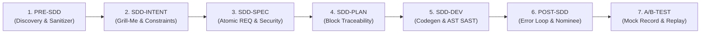

# Corporate Spec-Kit & B2B-Harness

> **Air-Gapped, Zero-Dependency Specification-Driven Development (SDD) Platform & Multi-Agent Normalization Harness**  
> Сертифицировано для изолированных корпоративных контуров, закрытых DMZ, рабочих станций разработчиков без прав администратора и сред без доступа в интернет.

[](#)
[-10b981.svg)](#)
[](#)
[](#)
[](#)
[](#)

---

## 1. Архитектурная триада: ЗАЧЕМ? ЧТО? ДЛЯ ЧЕГО?

Платформа решает фундаментальную проблему: **vibe-coding позволяет вынуть идеи из головы эксперта быстро, но переиспользовать результат «как есть» невозможно из-за разного техстека, отсутствия тестов, утечек секретов и непонимания, откуда что родилось**.

| Вопрос | Смысл в B2B-Harness & Corporate Spec-Kit |
|---|---|
| **ЗАЧЕМ?** | Чтобы устранить хаос в корпоративной разработке: исключить утечки боевых токенов из любительского кода экспертов, остановить зацикливание агентов-кодеров, дать руководству и ИБ 100% прозрачность («откуда что родилось»), и запустить конвейер на ПК без интернета и без прав администратора. |
| **ЧТО?** | Автономная платформа на 100% стандартной библиотеке Python 3.8+ (Zero-Dependency), включающая 7-стадийный SDD-конвейер нормализации (`PRE-SDD → INTENT → SPEC → PLAN → DEV → POST-SDD → A/B`), пре-флайт очистку секретов, песочницу без сети, AST SAST аудит, CycloneDX SBOM, детерминированное A/B тестирование и темный Glassmorphism Web UI с интерактивным графом Lineage DAG. |
| **ДЛЯ ЧЕГО?** | Чтобы за 5 минут превратить сырой PoC эксперта в стандартизированный, безопасный и переиспользуемый программный модуль с контрактом MCP tools / OpenAPI, готовый для встраивания в Core-агентов компании. |

> 📖 **Полный концептуальный разбор по всем ролям и компонентам доступен в документе:**  
> [docs/CONCEPTUAL_GUIDE_WHY_WHAT_FOR_WHAT.md](docs/CONCEPTUAL_GUIDE_WHY_WHAT_FOR_WHAT.md)

### Главные технологические инварианты:
1. **Zero-Dependency (Чистый Python)**: Работает на 100% встроенной стандартной библиотеке Python 3.8+ (`http.server`, `sqlite3` WAL, `difflib`, `hashlib`, `urllib`, `ast`, `zipfile`). **Не требует `pip`, `venv`, `uv`, `npm` или `node`.**
2. **Запуск в 1 клик прямо из Git**: Скачал репозиторий с гита — запустил `run.bat` на Windows или `run.sh` на Linux/macOS. Сервер стартует локально на `127.0.0.1:8765` и автоматически открывает браузер.
3. **Автономный Web UI**: Dark Glassmorphism интерфейс, чистый Vanilla JS + SVG. Никаких внешних CDN, веб-шрифтов или внешних скриптов — все файлы отдаются локально из коробки.
4. **Рабочая папка проекта (`workspace/`)**: Предусмотрена локальная директория, куда можно скопировать vibe-код руками либо загрузить файлы и `.zip` архивы прямо через веб-интерфейс (Drag & Drop) с автоматической безопасной распаковкой.
5. **Подключение любых провайдеров LLM**: Поддерживается работа с локальным/корпоративным GigaCode, Ollama, vLLM, LM Studio, OpenAI, Claude через стандартный HTTP-мост (`urllib.request`). При отсутствии подключения система мгновенно переходит в **100% автономный офлайн режим** (Rule-based Fallback).

---

## 2. Быстрый старт (Установка и Запуск за 10 секунд)

### Требования к системе:
- **Python 3.8+** (рекомендуется Python 3.10 — 3.12), установленный в системе.
- Любой современный браузер (Chrome, Edge, Firefox, Yandex Browser, Safari).
- **Никаких дополнительных пакетов ставить не нужно!**

### Шаг 1. Клонирование или скачивание архива
```bash
git clone https://github.com/your-org/corporate_speckit.git
cd corporate_speckit
```

### Шаг 2. Запуск в один клик

- **На Windows**:
  Дважды кликните по файлу `run.bat` или выполните в консоли:
  ```cmd
  run.bat
  ```
- **На Linux / macOS**:
  ```bash
  chmod +x run.sh
  ./run.sh
  ```
- **Ручной запуск через Python**:
  ```bash
  python run_speckit.py --port 8765 --host 127.0.0.1
  ```

Интерфейс откроется по адресу: **`http://127.0.0.1:8765`**.

---

## 3. Подключение провайдеров LLM (AI-ассистент и кодогенерация)

Платформа обращается к LLM через встроенный модуль `server/ai_bridge.py` на стандартной библиотеке `urllib.request`. Она совместима с любым OpenAI-совместимым API.

### Вариант А. Настройка через Web UI (в 1 клик)
1. Откройте вкладку **«Corporate Export & Settings»** в веб-интерфейсе.
2. В блоке **«AI LLM Endpoint & Configuration»** укажите параметры:
   - **Endpoint URL**: адрес вашего API (например, `http://localhost:11434/v1` для Ollama или корпоративный адрес GigaCode/шлюза).
   - **Model Name**: имя модели (`gigacode`, `llama3`, `qwen2.5-coder`, `gpt-4o`).
   - **API Key**: токен доступа (если требуется; для локального Ollama можно оставить пустым).
3. Нажмите **«Save Settings»**. Настройки сохраняются в локальной SQLite БД (`speckit.db`).

### Вариант Б. Настройка через переменные окружения
Перед запуском можно объявить переменные:
```bash
# Для Windows PowerShell:
$env:LLM_API_BASE = "http://localhost:11434/v1"
$env:LLM_MODEL = "llama3"
$env:LLM_API_KEY = "your-corporate-key"
python run_speckit.py

# Для Linux / macOS:
export LLM_API_BASE="http://localhost:11434/v1"
export LLM_MODEL="llama3"
export LLM_API_KEY="your-corporate-key"
./run.sh
```

### Вариант В. Полный офлайн / Air-Gapped режим (Без LLM)
Если в вашей закрытой сети нет доступа к LLM-серверам, **ничего настраивать не нужно**.
Платформа оснащена встроенными эвристическими генераторами:
- Автоматически формирует архитектурные вопросы уточнения (Clarifications).
- Декомпозирует требования на задачи и привязывает тестовые сценарии.
- Сканирует код по AST-правилам безопасности (SQLi, Command Injection, eval, path traversal).

---

## 4. Рабочая папка (`workspace/`) и Загрузка файлов

Для удобной работы в корень платформы встроена рабочая директория:
```
corporate_speckit/
└── workspace/                  # Рабочая папка проектов и файлов
    ├── my_vibe_poc/            # Положенный руками vibe-код
    └── finance_parser/         # Распакованный проект
```

### Как добавить свой проект или файлы:

1. **Способ 1: Скопировать руками на диске**:
   - Просто скопируйте папку со своим кодом или референсом внутрь `corporate_speckit/workspace/<имя_проекта>/`.
   - Система автоматически обнаружит папку при сканировании.

2. **Способ 2: Загрузить через Web UI (Drag & Drop)**:
   - Откройте вкладку **«📂 Рабочая папка (Workspace)»** в интерфейсе.
   - Перетащите файлы или `.zip` архив проекта в область загрузки.
   - При загрузке `.zip` архива можно отметить чекбокс **«Распаковать архив»** — платформа безопасно извлечет содержимое (с защитой от Zip-Slip уязвимостей).

3. **Загрузка вложений на любом этапе ТЗ (Stage Attachments)**:
   - В модуле **Stage Attachments** к любому этапу жизненного цикла (PRE-SDD, Intent, Spec, Plan, Dev, Test) можно прикрепить архитектурную диаграмму, OpenAPI/Swagger файл или SQL-дамп.
   - Файлы хэшируются по SHA-256, сохраняются в `specs_storage/<spec_id>/attachments/<stage>/` и автоматически отображаются как кликабельные узлы `[📎 имя_файла]` на графе DAG.

---

## 5. Интерактивный Граф Происхождения (Lineage DAG)

Граф происхождения отвечает на главный вопрос: **«Откуда что родилось?»**.

### Кликабельность и взаимодействие:
- **Каждая карточка на графе кликабельна**:
  - `CONSTITUTION` / `INTENT` — бизнес-цели и конституционные запреты.
  - `REQ-xxx` — атомарные требования с критериями приёмки.
  - `CLAR-xxx` — вопросы и ответы интервью-уточнений.
  - `TASK-xxx` — задачи на реализацию.
  - `CODE / TESTS` — сгенерированные файлы кода и тестов.
  - `[📚 ADR-xxx]` — архитектурные решения из Базы Знаний.
  - `[📎 файл]` — вложения этапов.
- **Что происходит при клике на узел**:
  1. **Подсветка предков («Откуда родилось»)**: Все узлы и ребра вверх по течению мгновенно подсвечиваются неоновым **Cyan** цветом.
  2. **Подсветка потомков («Импакт / Наследники»)**: Все зависимые задачи, тесты и файлы кода подсвечиваются неоновым **Emerald** цветом.
  3. **Приглушение несвязанных элементов**: Все остальные узлы становятся полупрозрачными, фокусируя внимание на сквозной трассировке.
  4. **Панель инспектора (Provenance Inspector)**: Справа открывается панель с полной карточкой сущности, метаданными, списком предков/потомков и кнопками быстрого перехода («Перейти к требованию», «Посмотреть диффы»).
  5. **Сброс выделения**: Клик по пустому фону или кнопка `✕ Clear` возвращает граф в исходное состояние.

---

## 6. Мультиагентный Конвейер B2B-Harness (7 Стадий SDD)

Подсистема `corporate_speckit/b2b_harness/` реализует полный конвейер нормализации кода:



1. **PRE-SDD**: Pre-Flight Secret Scrubbing (очистка захардкоженных API ключей и паролей) + безопасный запуск в изолированной песочнице без сети (`network: none`, cgroups) + генерация `discovery.md`.
2. **SDD-INTENT**: Нормализация в `intent.md`, детекция неоднозначностей, запуск опросника эксперта (Clarification Interview / "Grill-Me").
3. **SDD-SPEC**: Подтягивание релевантных правил из Репозитория Требований (`req_bank`), генерация неизменяемого `spec.md` с критериями приемки.
4. **SDD-PLAN**: Построение плана разработки `plan.md` с алгоритмической проверкой 100% покрытия требований (0 orphan-требований).
5. **SDD-DEV**: Генерация кода дистрибутива, прогон тестов, AST SAST аудит (SEC-001 ... SEC-006) и генерация CycloneDX SBOM.
6. **POST-SDD**: Анализ логов тестирования. Цикл доработок (до 3 итераций), автоматическая эскалация человеку при превышении порога, извлечение успешных фиксов в кандидаты требований `nominee-xxx.md`.
7. **A/B-TEST**: Параллельное сравнительное тестирование эталона и дистрибутива через Mock Gateway (детерминированная запись и воспроизведение I/O), генерация `test_log.md` и `spec_correction.md`.

---

## 7. Модульная плагинная архитектура

Платформа автоматически находит любые расширения в папке `corporate_speckit/modules/`:
- **`knowledge_base`**: База архитектурных решений (ADR) с привязкой к требованиям.
- **`req_bank`**: Корпоративный репозиторий повторно используемых требований (ФЗ-152, ГОСТ, OWASP, ASVS) с добавлением в проект в 1 клик.
- **`stage_attachments`**: Загрузка файлов на любом этапе жизненного цикла.
- **`workspace`**: Управление файлами и проектами рабочей папки.

Любой собственный модуль создается наследованием от `BaseModule` в 15 строк кода.

---

## 8. Прогон тестов (100% Green, Zero Dependencies)

Вся кодовая база покрыта строгими тестами на чистом встроенном `unittest`:

```bash
# 1. Запуск всех тестов B2B-Harness
python corporate_speckit/test_b2b_harness.py

# 2. Запуск тестов оркестратора и A2A пайплайна
python corporate_speckit/test_orchestrator_pipeline.py

# 3. Запуск базового тестового набора Spec-Kit (БД, diff, граф, экспорт)
python corporate_speckit/test_standalone.py

# 4. Запуск тестов модульной архитектуры
python corporate_speckit/test_modules.py

# 5. Запуск тестов безопасности, SHA-256 аудита и офлайн-бандлера
python corporate_speckit/test_security_bundle.py
```

Результат: **59 тестов пройдено, 0 сбоев, 100% чистота стандартной библиотеки.**
