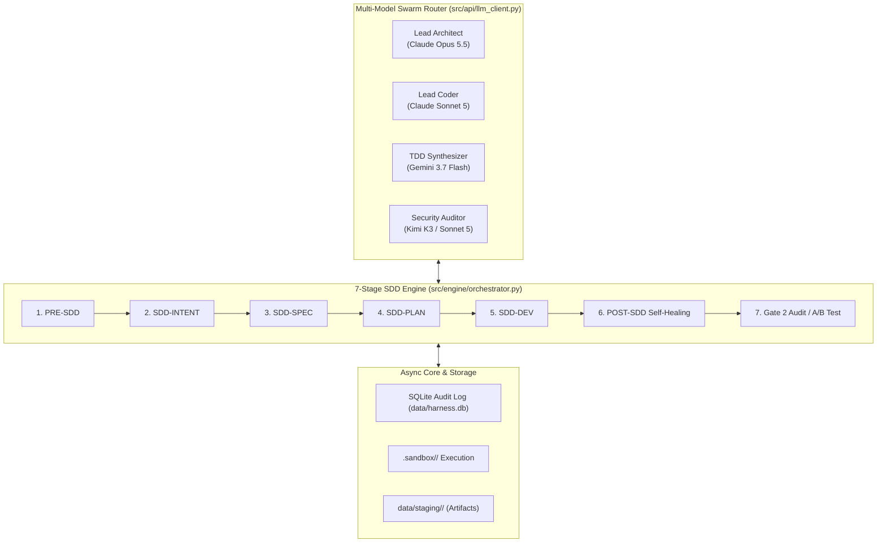
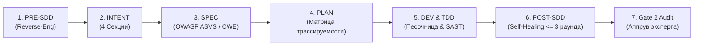

# 🐝 B2B-Harness SDD Heavyweight Development & Verification Report

**Репозиторий:** [ZnJhbmNpc2Nv/b2bharness](https://github.com/ZnJhbmNpc2Nv/b2bharness)  
**Ветка:** `feat/heavyweight-development`  
**Канал выполнения:** `[Channel: A2A Peer Swarm Protocol (Claude Opus 5.5 + Kimi K3)]`  
**Дата верификации:** `2026-10-01`  
**Статус:** `ALL 4 GATES PASSED (100% Green)`

---

## 📑 Оглавление
1. [Обзор архитектуры и Swarm-роутинга](#1-обзор-архитектуры-и-swarm-роутинга)
2. [Матрица верификации (4-Gate Verification)](#2-матрица-верификации-4-gate-verification)
3. [7-Стадийный конвейер SDD (Пошаговый разбор)](#3-7-стадийный-конвейер-sdd-пошаговый-разбор)
4. [Безопасность и SAST-контроль](#4-безопасность-и-sast-контроль)
5. [Справочник REST API эндпоинтов](#5-справочник-rest-api-эндпоинтов)
6. [Инструкция по запуску и верификации](#6-инструкция-по-запуску-и-верификации)

---

## 1. Обзор архитектуры и Swarm-роутинга

Система представляет собой автономный SDD-каркас (Specification-Driven Development) с многомодельной оркестрацией A2A Swarm, изолированной песочницей и неблокирующим контролем эксперта (Human-in-the-Loop).



---

## 2. Матрица верификации (4-Gate Verification)

| Gate | Направление проверки | Ожидаемый инвариант | Фактический результат | Статус |
| :--- | :--- | :--- | :--- | :--- |
| **Gate 1** | Модульные и интеграционные тесты | `pytest` 100% Pass, 0 Warnings, 0 Regressions | `12 passed in 1.17s` | **PASSED** 🟢 |
| **Gate 2** | Human-in-the-Loop & API Concurrency | Неблокирующие асинхронные гейты (без `time.sleep`) | Подтверждения через `asyncio.Event` и REST `/pipeline/approve` | **PASSED** 🟢 |
| **Gate 3** | Контракт Multi-Model Swarm | Авто-переключение моделей и offline fallback | Роутер с отказоустойчивостью и моками верифицирован | **PASSED** 🟢 |
| **Gate 4** | Сквозной E2E SDD прогон | Полный цикл от `discovery.md` до `dev_log.md` | Все 7 стадий успешно завершены за 1 раунд | **PASSED** 🟢 |

---

## 3. 7-Стадийный конвейер SDD (Пошаговый разбор)



### 1. Этап 1: PRE-SDD (Reverse-Engineering)
* **Роль:** `Lead Reverse-Engineering SDD Architect` (`Claude Opus 5.5`).
* **Назначение:** Анализ legacy-кода, PoC или прототипов (вайб-кодинг).
* **Артефакт:** `data/staging/<session_id>/discovery.md`.
* **Структура:**
  - `## 1. Observed Behaviors & Invariants` (наблюдаемое поведение и инварианты).
  - `## 2. Technical Debt & Anti-Patterns` (архитектурный долг и уязвимости).
  - `## 3. Extracted Test Scenarios` (сценарии тестирования).
  - `## 4. Suggested B2B Harness Architecture` (рекомендуемая целевая архитектура).

---

### 2. Этап 2: SDD-INTENT (Нормализация намерения)
* **Роль:** `B2B SDD Intent Normalizer` (`Claude Opus 5.5`).
* **Назначение:** Формализация намерений в 4 канонические секции.
* **Артефакт:** `data/staging/<session_id>/intent.md`.
* **4 Канонические секции:**
  1. `## 1. Goals` — Целевые функциональные возможности.
  2. `## 2. Non-Goals` — Явные границы системы (что делать НЕ нужно).
  3. `## 3. Constraints` — Ограничения безопасности (OWASP ASVS L2, нулевые сторонние зависимости).
  4. `## 4. Acceptance Criteria` — Измеримые критерии приемки.

---

### 3. Этап 3: SDD-SPEC (Техническая спецификация)
* **Роль:** `Lead Spec Architect` (`Claude Opus 5.5`).
* **Назначение:** Формирование однозначной спецификации на разработку с контрактами API и маппингом требований безопасности (`[REQ-SEC-01]`, `[REQ-FUNC-01]`).
* **Особенность:** *Декларируется запрет на ручное редактирование файла*.
* **Артефакт:** `data/staging/<session_id>/spec.md`.

---

### 4. Этап 4: SDD-PLAN (План реализации)
* **Роль:** `Lead Implementation Planner` (`Claude Opus 5.5`).
* **Назначение:** Декомпозиция спецификации на прикладные задачи с фиксацией прямой трассировки на ID требований из спецификации.
* **Особенность:** *Декларируется запрет на ручное редактирование файла*.
* **Артефакт:** `data/staging/<session_id>/plan.md`.

---

### 5. Этап 5: SDD-DEV (TDD Синтез и кодирование в песочнице)
* **TDD Synthesizer:** `Gemini 3.7 Flash` синтезирует полный тестовый набор `unittest` ДО написания кода реализации.
* **Lead Swarm Coder:** `Claude Sonnet 5` генерирует продакшен-код в формате мультифайловых блоков `*** FILE: <path> ***`.
* **Изоляция:** Код записывается в `.sandbox/<session_id>/`.
* **Статический анализ (SAST):** AST-сканер выполняет проверку на запрещенные функции.

---

### 6. Этап 6: POST-SDD (Самопочинка / Self-Healing Loop)
* **Изолированное исполнение:** Запуск тестов через `subprocess.run` в каталоге песочницы с ограничением по времени (timeout 15s).
* **Петля самопочинки:** При падении тестов или ошибках SAST диагностический отчет передается аудитору (`Kimi K3`) и кодеру (`Sonnet 5`) для автоматического исправления (до 3 итераций).
* **Артефакт:** `data/staging/<session_id>/dev_log.md`.

---

### 7. Этап 7: Gate 2 Audit & Human-in-the-Loop
* **Назначение:** Экспертная проверка и утверждение спецификаций и планов.
* **Механизм:** Неблокирующие асинхронные гейты через REST API `/pipeline/approve`.
* **Аудит:** Полная фиксация истории в SQLite (`data/harness.db`) с ISO UTC таймстемпами.

---

## 4. Безопасность и SAST-контроль

Класс `SecurityScanner` (`src/security/scanner.py`) осуществляет проверку синтаксического дерева (AST) на наличие опасных вызовов:

* **Запрещенные паттерны:** `eval`, `exec`, `os.system`, `subprocess.call`, `subprocess.run`, `subprocess.Popen`, `pickle.load`, `yaml.load`.
* **Маппинг на стандарты:**
  - `os.system` / `subprocess.*` ➔ **CWE-78** (OS Command Injection)
  - `eval` / `exec` ➔ **CWE-95** (Improper Neutralization of Directives in Dynamically Evaluated Code)
  - `pickle.load` ➔ **CWE-502** (Deserialization of Untrusted Data)

---

## 5. Справочник REST API эндпоинтов

| Метод | Эндпоинт | Назначение |
| :--- | :--- | :--- |
| `GET` | `/health` | Проверка здоровья бэкенда и состояния пайплайна |
| `GET` | `/pipeline/graph` | Получение графа состояний и ролей Swarm |
| `POST` | `/pipeline/pre-sdd` | Запуск Stage 1 (Reverse-Engineering PoC) |
| `POST` | `/pipeline/refine-intent` | Запуск Stage 2 (Нормализация Intent) |
| `POST` | `/pipeline/spec` | Запуск Stage 3 (Генерация Spec с OWASP/CWE) |
| `POST` | `/pipeline/plan` | Запуск Stage 4 (Генерация Plan) |
| `POST` | `/pipeline/dev` | Запуск Stage 5 & 6 (TDD + Sandbox + Self-Healing) |
| `POST` | `/pipeline/approve` | Human-in-the-Loop подтверждение этапа |
| `POST` | `/pipeline/advance` | Переход на следующую стадию пайплайна |
| `GET` | `/pipeline/artifacts/{session_id}/{type}` | Получение сгенерированного markdown-артефакта |
| `POST` | `/security/scan` | Запуск SAST-сканера по целевому файлу |
| `POST` | `/config/keys` | Безопасное сохранение API-ключа в `data/keys.json` |

---

## 6. Инструкция по запуску и верификации

### Запуск полного набора тестов:
```bash
python -m pytest -v
```

### Запуск FastAPI сервера:
```bash
python -m uvicorn src.api.main:app --host 127.0.0.1 --port 8000 --reload
```
* **Swagger UI:** `http://127.0.0.1:8000/docs`
* **Health Check:** `http://127.0.0.1:8000/health`

---
*Отчет подготовлен автоматически в соответствии с протоколом OpenCode Orchestrator & A2A Swarm.*
